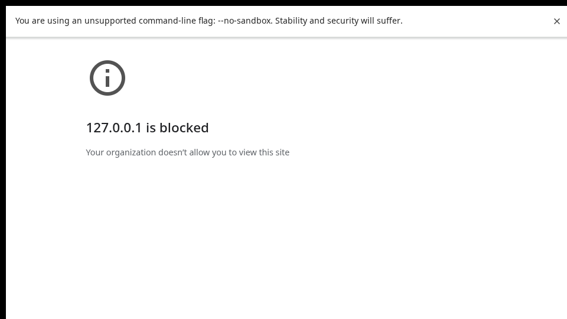

<div align="center">

# 🪐 Planetarium

### Tiny procedural worlds from a single name.

Type a planet name. Change its temperature. Watch its terrain, oceans, ice, life, clouds, moons and atmosphere react.

[](https://github.com/Draconov/Planetarium/releases/latest)
[](https://github.com/Draconov/Planetarium/actions/workflows/build.yml)
[](https://github.com/Draconov/Planetarium/actions/workflows/pages.yml)

[](https://draconov.github.io/Planetarium/)
[](https://github.com/Draconov/Planetarium/releases/latest)

[](https://github.com/Draconov/Planetarium/releases)
[](https://github.com/Draconov/Planetarium/stargazers)
[](https://github.com/Draconov/Planetarium/forks)
[](https://github.com/Draconov/Planetarium/issues)


**[▶ Play](https://draconov.github.io/Planetarium/)** · **[⬇ Releases](https://github.com/Draconov/Planetarium/releases/latest)** · **[⚙ Actions](https://github.com/Draconov/Planetarium/actions)** · **[🌐 Pages](https://github.com/Draconov/Planetarium/deployments)**



</div>

---

## ✨ About

**Planetarium** is a compact **480×270 procedural planet generator**. A planet name acts as a deterministic seed, so the same name always produces the same world.

This repository is a source reconstruction of the original Planetarium project after its original development source was lost. The original release supplied the visual/audio assets and behavioral reference; the current application logic was rebuilt as a fresh implementation.

> **Current version:** `1.0.0`

## 🚀 Quick links

| | Destination |
| --- | --- |
| 🌍 **Play in browser** | **https://draconov.github.io/Planetarium/** |
| 📦 **Latest release** | **https://github.com/Draconov/Planetarium/releases/latest** |
| 🪟 **Windows builds** | Available from **Releases** and CI artifacts |
| 🧪 **Build status** | **https://github.com/Draconov/Planetarium/actions/workflows/build.yml** |
| 🌐 **Pages status** | **https://github.com/Draconov/Planetarium/actions/workflows/pages.yml** |

## 🌌 Features

- 🪐 **Deterministic procedural planets** generated from names
- 🌡️ **Temperature simulation** that changes the world
- 🌊 Oceans, beaches and coastlines
- 🏔️ Mountains and terrain variation
- ❄️ Ice and frozen regions
- 🌱 Temperature-dependent life
- ☁️ Procedural cloud layers
- ✨ Star fields
- 🌙 Moons and occasional planetary rings
- 🔥 Normal and temperature visualization modes
- ⏪ Reversible time
- ⏩ Accelerated time
- 🚀 Rocket launch effect
- 📸 PNG screenshots
- 🎵 Music mute toggle
- 🎲 Random planet generation
- 💾 Per-planet temperature persistence
- 🖱️ Mouse controls
- ⌨️ Keyboard controls
- 🥚 Special named planets and Easter eggs
- 🎨 Original pixel sprites and bitmap-font presentation

## 🎮 Controls

| Input | Action |
| --- | --- |
| Type a name + **Enter** | Visit / generate the planet |
| **0** or **?** | Generate a random planet |
| **← / →** | Change temperature |
| **↑ / ↓** | Change temperature while not typing |
| **Tab** | Toggle temperature view |
| **1** | Reverse time |
| **2** | Cycle time speed |
| **3** | Launch rocket |
| **4** | Save screenshot |
| **5** | Mute / unmute |
| **Alt + Enter** | Toggle fullscreen |
| **Double-click** | Toggle fullscreen |

The bottom control bar is also fully usable with the mouse.

## 🌐 Play on GitHub Pages

The web build is deployed automatically from `main` / `master` by GitHub Actions.

### **[▶ Launch Planetarium](https://draconov.github.io/Planetarium/)**

If you fork the repository, enable it once under:

**Settings → Pages → Build and deployment → Source → GitHub Actions**

The Pages workflow is located at:

```text
.github/workflows/pages.yml
```

The site uses relative asset paths and ships `.nojekyll`, so repository-subpath hosting works correctly.

## 📥 Downloads

### Windows

Prebuilt Windows packages are published from version tags:

### **[⬇ Download latest Planetarium release](https://github.com/Draconov/Planetarium/releases/latest)**

A release contains the Windows x64 portable application and ZIP package generated by `electron-builder`.

CI builds from ordinary pushes are also available under **Actions → Build → Artifacts**.

### Web

The browser edition is available directly through GitHub Pages. The static build is also produced by CI as the `Planetarium-web` artifact.

## 🛠️ Development

### Requirements

- **Node.js 20+**
- npm
- Windows is required only when building the Windows desktop package locally

The browser application itself has no runtime npm dependencies.

### Run locally

```bash
npm run dev:web
```

Then open:

```text
http://127.0.0.1:8080
```

On Windows you can simply run:

```text
run-dev.bat
```

### Validate the source

```bash
npm run check
```

This checks JavaScript syntax and verifies that all required bundled resources exist.

## 🏗️ Build

### Web

```bash
npm run build:web
```

Windows shortcut:

```text
build-web.bat
```

Output:

```text
dist/web/
```

The output is a completely static site suitable for GitHub Pages, itch.io, Netlify, Cloudflare Pages, or a normal web server.

### Windows

Install development dependencies:

```bash
npm install
```

Then:

```bash
npm run build:win
```

or on Windows:

```text
build-windows.bat
```

Output:

```text
release/
├── Planetarium-1.0.0-Windows-x64.exe
└── Planetarium-1.0.0-Windows-x64.zip
```

The `.exe` is a portable build; no installer is required.

## 🏷️ Releases & versioning

The application version lives in `package.json`:

```json
"version": "1.0.0"
```

Version tags use the conventional `vX.Y.Z` format.

Example:

```bash
git tag v1.0.0
git push origin v1.0.0
```

Pushing a `v*` tag runs the full build workflow and automatically creates a GitHub Release with the generated downloadable packages.

Recommended versioning:

- `1.0.1` — bug fix
- `1.1.0` — new backwards-compatible features
- `2.0.0` — major redesign or incompatible changes

## 🤖 GitHub Actions

### Build

`.github/workflows/build.yml`

Runs on:

- pushes to `main` / `master`
- pull requests
- `v*` version tags
- manual workflow dispatch

It validates and produces:

| Artifact | Contents |
| --- | --- |
| `Planetarium-web` | Static browser build |
| `Planetarium-Windows` | Portable Windows `.exe` and ZIP |

When triggered by a `v*` tag, those build outputs are also attached to a GitHub Release.

### GitHub Pages

`.github/workflows/pages.yml`

Every push to `main` / `master` rebuilds and deploys the browser edition to:

**https://draconov.github.io/Planetarium/**

## 📁 Repository structure

```text
Planetarium/
├── .github/
│   └── workflows/
│       ├── build.yml          # CI, desktop/web builds and tagged releases
│       └── pages.yml          # GitHub Pages deployment
├── build/
│   └── icon.ico               # Windows packaging icon
├── desktop/
│   └── main.cjs               # Electron desktop launcher
├── scripts/
│   ├── build-web.mjs          # Static web builder
│   ├── check-assets.mjs       # Resource validation
│   └── serve.mjs              # Dependency-free local server
├── src/
│   ├── assets/                # Original bundled art/audio resources
│   ├── app.js                 # Main Planetarium implementation
│   ├── font_data.js           # Bitmap-font data
│   └── index.html             # Browser entry point
├── build-web.bat
├── build-windows.bat
├── run-dev.bat
├── package.json
├── preview.png
└── README.md
```

## 🧭 Architecture

Planetarium intentionally stays small:

```text
Planet name
    │
    ▼
Deterministic seed
    │
    ├── terrain
    ├── climate / temperature
    ├── water / ice
    ├── life
    ├── clouds
    ├── moons / rings
    └── visual details
            │
            ▼
       480 × 270 renderer
```

The same browser code powers both editions. Electron simply packages the static web build as the Windows desktop application.

## 💾 Reconstruction

This repository is a **source restoration/reconstruction**, not a byte-for-byte recovery of the lost GameMaker project files.

The original release executable was used as the behavioral and visual reference. Original bundled visual/audio resources were recovered from that release, while the current application logic was rewritten to reproduce the original program's behavior in a maintainable modern codebase.

## 📜 License

No public software license is currently granted. Unless a license is added later, **all rights are reserved**.

---

<div align="center">

### 🪐 Generate something weird.

**[Play Planetarium](https://draconov.github.io/Planetarium/)** · **[Download](https://github.com/Draconov/Planetarium/releases/latest)**

`Planetarium v1.0.0`

</div>
